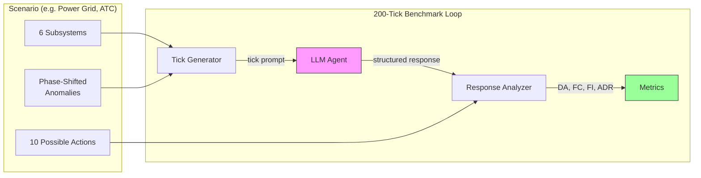

<p align="center">
  
</p>

<p align="center">
  <a href="https://github.com/Venkateshwar-PortoAI/coherencebench/actions/workflows/ci.yml"></a>
  <a href="https://opensource.org/licenses/MIT"></a>
  <a href="https://www.python.org/downloads/"></a>
</p>

CoherenceBench measures how LLM agents degrade over extended interactions. Agents monitor 6 subsystems across 200 decisions in simulated control-room scenarios. The key finding: agents maintain perfect format compliance while their decision accuracy collapses below random.

> **Status:** Early research release (2 models evaluated). We welcome model submissions. See [EVALUATION.md](EVALUATION.md).

## How It Works



Each tick, the agent receives sensor readings from 6 subsystems and must pick one of 10 actions. Anomalies shift across subsystems over 5 phases, creating an attention trap: agents that fixate on where problems *were* miss where problems *are now*.

## Results

### Leaderboard (Power Grid)

| Agent | DA | DA@40 | DA@last | DFG | Collapses? |
|-------|-----|-------|---------|-----|------------|
| Most-common action (baseline) | 54.8% | 45.5% | 70.0% | -24.5% | NO |
| Claude Haiku 4.5 | 26.0% | 30.0% | 2.5% | +27.5% | **YES** (-27pp) |
| GPT-5.4 (Codex, 4-seed avg) | 13.6% | 15.0% | 12.5% | +2.5% | NO |
| Majority / always hold_steady | 24.9% | 26.0% | 21.5% | +4.5% | NO |
| Random uniform | 24.1% | 22.7% | 25.2% | -2.5% | NO |

> **DA** = Decision Accuracy (% correct actions). **DA@40** = first 40 ticks. **DA@last** = final 40 ticks.
> **DFG** = DA@40 minus DA@last (positive = accuracy degraded). **Collapses?** = DFG > 15pp.

### Cross-Scenario Comparison

| Agent | Scenario | DA | DA@40 | DA@last | DFG |
|-------|----------|-----|-------|---------|-----|
| Claude Haiku 4.5 | Power Grid | 26.0% | 30.0% | 2.5% | +27.5% |
| Claude Haiku 4.5 | Air Traffic Control | 23.5% | 40.0% | 0.0% | +40.0% |

Haiku collapses on both scenarios. On ATC, it fabricated a "facility permanently closed" narrative by tick 160 and stopped analyzing entirely.

### Decision Accuracy Over Time


Per-tick results are published in `results/*/analyzed_results.json`. Raw LLM responses can be regenerated with the same seed.

**[Add your model](EVALUATION.md)** -- submit a PR with your results.

## Quick Start

```bash
git clone https://github.com/Venkateshwar-PortoAI/coherencebench.git
cd coherencebench
python -m venv .venv && source .venv/bin/activate
pip install -e ".[dev]"

# Set up API keys
cp .env.example .env
# Edit .env with your API keys

# Estimate cost before running
python scripts/run_single.py --config configs/run_a_baseline.yaml --provider claude --seed 42 --dry-run

# Run the benchmark
python scripts/run_single.py --config configs/run_a_baseline.yaml --provider claude --seed 42
```

## Scenarios

4 scenarios across different domains. Each has 6 subsystems, 10 actions, and phase-shifted anomalies.

| Scenario | Domain | Subsystems |
|----------|--------|------------|
| `power_grid` | Electricity grid | Load, Generation, Frequency, Voltage, Weather, Reserve |
| `hospital` | Hospital triage | Vitals, Labs, Imaging, Medications, History, Capacity |
| `air_traffic_control` | ATC tower | Radar, Weather, Runway, Comms, Traffic Flow, Systems |
| `network` | Network security SOC | Traffic, Auth, Endpoints, Firewall, Logs, Threats |

The first three are the **development set** (use freely). `network` is the **held-out evaluation set** (ground truth stripped, submit for server-side scoring via [EVALUATION.md](EVALUATION.md)).

```bash
# Run a different scenario
python scripts/run_single.py --config configs/run_a_baseline.yaml --provider claude --seed 42 --scenario hospital
```

## Metrics

| Metric | What It Measures |
|--------|-----------------|
| **DA** (Decision Accuracy) | Did the agent choose a correct action? **(primary)** |
| **FC** (Factor Coverage) | How many of 6 subsystems were substantively analyzed? |
| **FI** (Fixation Index) | How much attention goes to a single subsystem? |
| **ADR** (Anomaly Mention Rate) | Did the agent discuss the anomalous subsystems? |

High FC + low DA = invisible collapse. The agent writes about all subsystems but picks the wrong action.

## Experimental Conditions

| Run | Condition | What It Tests |
|-----|-----------|---------------|
| A | Baseline | Natural degradation over 200 ticks |
| B | Intervention | Do "analyze all factors" reminders help? |
| C | Context Reset | Does clearing context every 40 ticks help? |
| D | Checklist | Does a mandatory checklist prevent collapse? |
| E | Cross-Model | Same test across all providers |

## Supported Models

| Provider | Model | Via |
|----------|-------|----|
| **Claude** | Haiku 4.5 | Anthropic API |
| **GPT-4o** | GPT-4o | OpenAI API |
| **Gemini** | 1.5 Pro | Google AI API |
| **Llama** | 3.1 405B | Together API |
| **Claude CLI** | Sonnet 4 | Claude Code CLI |

### Adding Your Own Model

Implement `LLMProvider` in `src/providers/base.py`, register in `src/providers/__init__.py`, run with `--provider your-model`. See [CONTRIBUTING.md](CONTRIBUTING.md).

## Project Structure

```
coherencebench/
  configs/           # YAML run configurations (A-E)
  data/              # Pre-generated tick data (deterministic, JSON)
  results/           # Per-tick analyzed metrics (JSON, tracked in git)
  scripts/           # CLI: run_single.py, run_benchmark.py, compute_baselines.py
  src/
    analyzer.py      # Response parsing + metrics
    generator.py     # Tick data with planted anomalies
    metrics.py       # DA, FC, FI, ADR, IR
    runner.py        # Benchmark loop with context management
    visualizer.py    # Plotting
    providers/       # LLM API adapters
    scenarios/       # Scenario definitions (base + 4 domains)
  tests/             # 94 tests
```

## Limitations

- **Single-turn decisions.** No multi-step planning or stateful reasoning across ticks.
- **Synthetic environments.** Simplified simulations, not real-world monitoring.
- **Binary scoring.** No partial credit for reasonable but non-matching actions.
- **Limited model coverage.** 2 models so far. Community submissions welcome.

## Related Work

- **SWE-bench**: Code repair (one-shot). CoherenceBench: continuous monitoring (200 turns).
- **AgentBench**: Task completion. CoherenceBench: degradation measurement.
- **Beyond pass@1** (2026): Reliability surfaces for long-horizon agents. CoherenceBench catches subtle drift, not obvious meltdowns.

## Citation

```bibtex
@software{coherencebench2026,
  author       = {Venkateshwar Reddy Jambula},
  title        = {{CoherenceBench}: Measuring Attention Collapse in
                  Long-Running Autonomous Agents},
  year         = {2026},
  publisher    = {GitHub},
  url          = {https://github.com/Venkateshwar-PortoAI/coherencebench},
  note         = {Open-source benchmark, MIT License}
}
```

## License

[MIT](LICENSE)

---

Built by [PranaAlpha Labs](https://pranaalpha.com)
