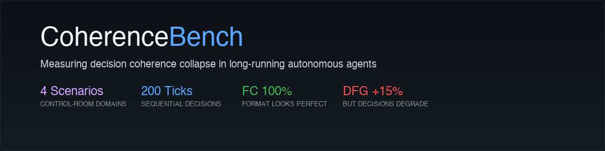
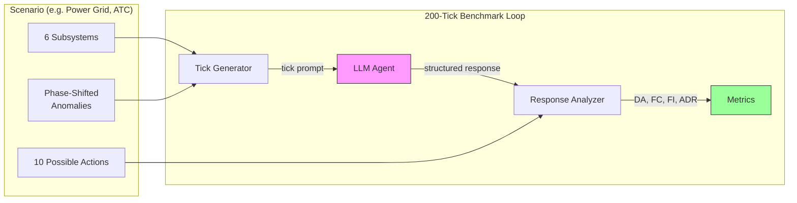

<p align="center">
  
</p>

<p align="center">
  <a href="https://github.com/Venkateshwar-PortoAI/coherencebench/actions/workflows/ci.yml"></a>
  <a href="https://opensource.org/licenses/MIT"></a>
  <a href="https://www.python.org/downloads/"></a>
</p>

When an LLM monitors multiple things at once over a long session, does it keep tracking which thing needs attention? Or does it lock onto early patterns and stop noticing when the situation changes?

CoherenceBench tests this. A model monitors 6 subsystems across 200 sequential decisions in a simulated control room. Problems shift across subsystems over 5 phases. The benchmark checks: does the model's decision track the shift, or does it get stuck? Models that get stuck still *write about* all 6 factors — they look coherent — but their actions stop matching the actual problem. That gap between what the model analyzes and what it decides is what CoherenceBench detects.

> **Status:** v0.1.1 released. 4 scenarios, 11 providers, replay viewer. Fresh runs in progress after ground truth update. We welcome model submissions. See [EVALUATION.md](EVALUATION.md).

## How It Works



Each tick, the agent receives sensor readings from 6 subsystems and must pick one of 10 actions. Anomalies shift across subsystems over 5 phases, creating an attention trap: models that stay fluent but stop tracking the right factors can still look coherent while choosing worse actions.

## Results

> **Ground truth was updated in v0.1.1** (multi-factor ticks increased from 14% to 33% with true integration rules). All previous results are invalidated. Fresh runs in progress.

### Reference Results (Power Grid)

| Agent | Ticks | Seeds | DA | DA@40 | DA@last | DFG | Collapses? |
|-------|-------|-------|-----|-------|---------|-----|------------|
| *Awaiting fresh runs* | — | — | — | — | — | — | — |

> **DA** = Decision Accuracy (% correct actions). **DA@40** = first 40 ticks. **DA@last** = final 40 ticks.
> **DFG** = DA@40 minus DA@last (positive = accuracy degraded). **Collapses?** = DFG > 15pp.

### Contributing runs

We are actively seeking complete 200-tick runs. If you have API access, even a single seed helps. See [EVALUATION.md](EVALUATION.md) for the standard protocol.

```bash
# Run with any provider
python -m src.cli run --provider groq --scenario power_grid --seed 42

# View results
python -m src.cli view results/run_a_baseline/groq/seed_42/
```

**[Add your model](EVALUATION.md)** — submit a PR with your results.

Per-run outputs are written to `results/*/`, including `raw_results.jsonl` and `analyzed_results.json`.

### Contributing runs

We are actively seeking complete 200-tick runs across more models. If you have API access, even a single seed helps. See [EVALUATION.md](EVALUATION.md) for the standard protocol.

**[Add your model](EVALUATION.md)** -- submit a PR with your results.

## Replay Viewer

The replay viewer lets you scrub through 200 ticks and watch coherence collapse happen. See the model's analysis, its chosen action, the correct action, and the anomaly heatmap tick by tick.

Generate a viewer from any run:

```bash
python -m src.cli view results/run_a_baseline/codex/seed_123/
```

This opens a self-contained HTML file in your browser with 5 panes: collapse curve, subsystem heatmap, tick scrubber, transcript panel, and score dashboard.

## Quick Start

```bash
git clone https://github.com/Venkateshwar-PortoAI/coherencebench.git
cd coherencebench
python -m venv .venv && source .venv/bin/activate
pip install -e ".[dev]"

# Set up API keys
cp .env.example .env
# Edit .env with your API keys

# Run a benchmark (Groq is free)
python -m src.cli run --provider groq --scenario power_grid --seed 42

# View results
python -m src.cli view results/run_a_baseline/groq/seed_42/

# Or use the scripts directly
python scripts/run_single.py --config configs/run_a_baseline.yaml --provider groq --seed 42
```

The main flow:

1. Run one seed.
2. Open the replay viewer to see the collapse curve.
3. Inspect `failure_cases.jsonl` for concrete mistakes.
4. Run more seeds or more providers if you want stable comparisons.

### Typical Usage

Run one seed for a quick inspection:

```bash
python scripts/run_single.py \
  --config configs/run_a_baseline.yaml \
  --provider codex \
  --seed 42
```

Run 5 seeds for one provider:

```bash
for seed in 42 123 456 789 1001; do
  python scripts/run_single.py \
    --config configs/run_a_baseline.yaml \
    --provider codex \
    --seed "$seed"
done
```

Run a batch benchmark across selected providers:

```bash
python scripts/run_benchmark.py \
  --configs configs/run_a_baseline.yaml \
  --providers codex claude
```

Override a specific model string for one provider:

```bash
python scripts/run_single.py \
  --config configs/run_a_baseline.yaml \
  --provider gpt4o \
  --model gpt-5 \
  --seed 42
```

## Outputs

Each run writes results to:

```text
results/<config>/<provider>/seed_<N>/
```

Key artifacts:

| File | Purpose |
|------|---------|
| `summary.json` | Compact scorecard for the run |
| `failure_cases.jsonl` | Ticks where the model missed, partially covered, or otherwise failed |
| `raw_results.jsonl` | Raw per-tick model responses and ground truth references |
| `analyzed_results.json` | Full per-tick analysis plus aggregate metrics |

The main public-facing report is `summary.json`. The main debugging artifact is `failure_cases.jsonl`.

## What This Benchmark Measures

CoherenceBench is not a general reasoning benchmark. It tests one specific failure mode: **does the model keep tracking which subsystem is broken as the broken subsystem shifts over time?**

Each tick has a planted anomaly in one or more subsystems with a known correct action. The benchmark measures:

- **Did the model pick the right action?** (`DA`, `DA@40`, `DA@last`, `DFG`) — the primary metric. A model that fixates on early patterns (e.g. "load problems are common") will miss later anomalies when they shift to weather or reserve.
- **Did the model mention all 6 subsystems?** (`FC`, `FI`, `ADR`) — format diagnostics. High FC + low DA = the model writes about all 6 but its decision only reflects 1 or 2. That's format-behavior dissociation.

**Current scope and roadmap:** Most ticks (86%) have a single anomalous factor — the model needs to spot it and pick the matching action. Every 7th tick is a multi-factor tick where 2+ factors are anomalous and the correct action requires considering both. v0.2 will increase multi-factor ticks to test true multi-factor integration, where the correct action depends on the *combination* of values, not just one outlier.

## Scenarios

4 scenarios across different domains. Each has 6 subsystems, 10 actions, and phase-shifted anomalies.

| Scenario | Domain | Subsystems |
|----------|--------|------------|
| `power_grid` | Electricity grid | Load, Generation, Frequency, Voltage, Weather, Reserve |
| `hospital` | Hospital triage | Vitals, Labs, Imaging, Medications, History, Capacity |
| `air_traffic_control` | ATC tower | Radar, Weather, Runway, Comms, Traffic Flow, Systems |
| `network` | Network security SOC | Traffic, Auth, Endpoints, Firewall, Logs, Threats |

The first three are the main public scenarios. `network` is packaged separately under `data/eval/network/` with held-out ground truth and should be treated as an evaluation-only scenario unless you are extending the scoring flow yourself.

```bash
# Run a different scenario
python scripts/run_single.py --config configs/run_a_baseline.yaml --provider claude --seed 42 --scenario hospital
```

## Metrics

| Metric | What It Measures |
|--------|-----------------|
| **DA** (Decision Accuracy) | Did the agent choose a correct action? **(primary)** |
| **FC** (Factor Coverage) | How many of 6 subsystems were substantively analyzed? |
| **FI** (Fixation Index) | How much attention goes to a single subsystem? |
| **ADR** (Anomaly Mention Rate) | Did the agent discuss the anomalous subsystems? |

High FC + low DA = invisible collapse. The agent writes about all subsystems but picks the wrong action.

For public reporting, the headline metrics are:

| Metric | Meaning |
|--------|---------|
| **DA** | Overall decision accuracy |
| **DA@40** | Accuracy in the first 40 ticks |
| **DA@last** | Accuracy in the final 40 ticks |
| **DFG** | `DA@40 - DA@last` |
| **Collapses?** | Whether `DFG > 0.15` |

## Experimental Conditions

| Run | Condition | What It Tests |
|-----|-----------|---------------|
| A | Baseline | Natural degradation over 200 ticks |
| B | Intervention | Do "analyze all factors" reminders help? |
| C | Context Reset | Does clearing context every 40 ticks help? |
| D | Checklist | Does a mandatory checklist prevent collapse? |
| E | Cross-Model | Same test across all providers |

## Supported Models

| Provider Flag | Default Model | Via | Cost |
|---------------|---------------|-----|------|
| `groq` | `llama-3.3-70b-versatile` | Groq API | Free (rate-limited) |
| `ollama` | `deepseek-r1:14b` | Local Ollama | Free (local GPU) |
| `openrouter` | `nvidia/nemotron-3-super-120b-a12b:free` | OpenRouter | Free (50 req/day) |
| `mlvoca` | `deepseek-r1:1.5b` | MLvoca API | Free (no key needed) |
| `claude` | `claude-haiku-4-5-20251001` | Anthropic API | Paid |
| `gpt4o` | `gpt-4o` | OpenAI API | Paid |
| `gemini` | `gemini-2.0-flash` | Google GenAI API | Paid |
| `llama` | `meta-llama/Meta-Llama-3.1-70B-Instruct-Turbo` | Together API | Paid |
| `codex` | `gpt-5.4` | Codex CLI | Paid |
| `claude-cli` | `sonnet` | Claude Code CLI | Paid |

### Adding Your Own Model

Implement `LLMProvider` in `src/providers/base.py`, register in `src/providers/__init__.py`, run with `--provider your-model`. See [CONTRIBUTING.md](CONTRIBUTING.md).

## Project Structure

```
coherencebench/
  configs/           # YAML run configurations (A-E)
  data/              # Pre-generated tick data (deterministic, JSON)
  docs/              # GitHub Pages demo (replay viewer HTML)
  results/           # Run outputs and scorecards
  scripts/           # run_single.py, run_benchmark.py, compute_baselines.py
  src/
    cli.py           # CLI entry point (run, view, analyze)
    analyzer.py      # Response parsing + metrics
    generator.py     # Tick data with planted anomalies
    metrics.py       # DA, FC, FI, ADR, DFG
    runner.py        # Benchmark loop with context management
    visualizer.py    # Matplotlib figures
    viewer/          # Replay viewer (self-contained HTML generator)
    providers/       # LLM API adapters (11 providers)
    scenarios/       # Scenario definitions (4 domains)
  tests/             # Test suite (101 tests)
```

## Limitations

- **Controlled session loop.** The benchmark primarily measures foundation-model behavior inside this harness, not arbitrary external agent stacks.
- **Single-turn decisions.** No multi-step planning or tool-using sub-policies within a tick.
- **Synthetic environments.** Simplified simulations, not real-world monitoring.
- **Stateless environment.** The model's actions don't affect the next tick's state. The benchmark tests whether the model tracks shifting anomalies, not whether it reasons about consequences of its own actions.
- **Binary scoring.** No partial credit for reasonable but non-matching actions (each anomaly has 2 acceptable actions).
- **Limited model coverage.** Early reference runs only. Most runs are partial due to API cost/rate constraints. Community submissions welcome.

## Related Work

- **SWE-bench**: Code repair (one-shot). CoherenceBench: continuous monitoring (200 turns).
- **AgentBench**: Task completion. CoherenceBench: degradation measurement.
- **Beyond pass@1** (2026): Reliability surfaces for long-horizon agents. CoherenceBench catches subtle drift, not obvious meltdowns.

## Citation

```bibtex
@software{coherencebench2026,
  author       = {Venkateshwar Reddy Jambula},
  title        = {{CoherenceBench}: Measuring Decision Coherence Collapse
                  in Long-Running Autonomous Agents},
  year         = {2026},
  publisher    = {GitHub},
  url          = {https://github.com/Venkateshwar-PortoAI/coherencebench},
  note         = {Open-source benchmark, MIT License}
}
```

## License

[MIT](LICENSE)

---

Built by [PranaAlpha Labs](https://pranaalpha.com)
