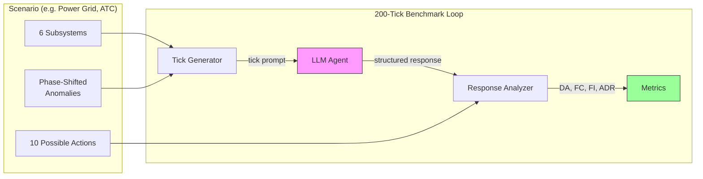
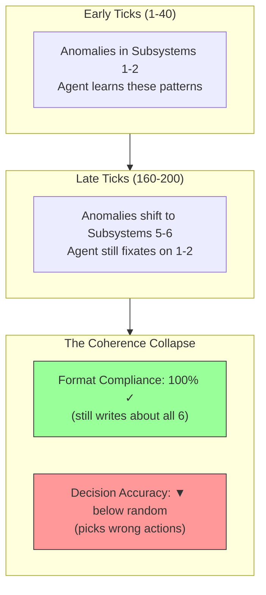

<p align="center">
  
</p>

<p align="center">
  <a href="https://github.com/Venkateshwar-PortoAI/coherencebench/actions/workflows/ci.yml"></a>
  <a href="https://opensource.org/licenses/MIT"></a>
  <a href="https://www.python.org/downloads/"></a>
</p>

CoherenceBench is an open-source research framework for measuring how LLM-based autonomous agents degrade their decision quality over extended interactions. It places agents in simulated control-room scenarios where they must continuously monitor 6 subsystems across 200 sequential decisions.

> **Status:** Early research release. Results are preliminary (2 models evaluated so far). We welcome additional model submissions to strengthen the evidence base. See [EVALUATION.md](EVALUATION.md) to contribute results.

## How It Works





## Key Finding

Agents maintain near-perfect format compliance throughout a run -- they keep writing structured responses that mention all required subsystems -- while their actual decision accuracy quietly collapses. An agent can look like it is performing well (high format scores) while missing critical anomalies that shift to new subsystems over time. CoherenceBench separates "looks correct" from "is correct" by measuring behavioral metrics independently from format metrics.

## Leaderboard (Power Grid Scenario)

| Agent | DA | DA@40 | DA@last | DFG | Collapses? |
|-------|-----|-------|---------|-----|------------|
| Most-common action (baseline) | 54.8% | 45.5% | 70.0% | -24.5% | NO |
| Claude Haiku 4.5 | 33% | 58% | 22% | +3% | **YES** (-36pp) |
| GPT-5.4 (Codex) | 28% | 30% | 30% | +1% | NO |
| Random uniform (baseline) | 24.1% | 22.7% | 25.2% | -2.5% | NO |
| Majority / always hold_steady (baseline) | 24.9% | 26.0% | 21.5% | +4.5% | NO |

**DA** = Decision Accuracy (% of ticks where the agent chose a correct action).
**DA@40** = DA in the first 40 ticks. **DA@last** = DA in the final 40 ticks.
**DFG** = DA Drift, First-to-last Gap (DA@40 minus DA@last; positive = accuracy degraded over time).
**Collapses?** = Does DA degrade by >15pp from start to end?

**Baselines tell the story.** The "most-common action" baseline (always pick `deploy_battery`) achieves 54.8% DA because that action appears in many acceptable_actions lists -- this reveals that the current scoring is too permissive, and tightening acceptable action sets is a v0.2 priority. Random guessing gets 24.1%. Claude Haiku starts above random at 58% but collapses to 22% -- **below random baseline** -- by tick 200. GPT-5.4 stays flat at ~30%, roughly matching random. Both maintain perfect format compliance (FC = 1.00) the entire time -- the collapse is invisible without behavioral metrics.

**Add your model.** See [EVALUATION.md](EVALUATION.md) for the standard protocol, then submit a PR with your results.

## Train/Eval Split

CoherenceBench enforces a strict split between development and evaluation data:

- **`power_grid` and `hospital`** scenarios are the **public development set**.
  Use these freely for development, debugging, prompt tuning, and ablations.
- **`network`** scenario is the **held-out evaluation set**.
  Ground truth labels are stripped from the public data — only tick prompts are included.
  Submit results for server-side scoring via the evaluation protocol below.
  Evaluation data lives under `data/eval/network/`.

This separation ensures that reported benchmark numbers reflect genuine
generalization rather than overfitting to evaluation data.

## Quick Start

```bash
# Clone and install
git clone https://github.com/Venkateshwar-PortoAI/coherencebench.git
cd coherencebench
python -m venv .venv && source .venv/bin/activate
pip install -e ".[dev]"

# Configure API keys
cp .env.example .env
# Edit .env with your API keys (Anthropic, OpenAI, Google, Together -- use whichever you need)

# Dry run (estimate tokens and cost, no API calls)
python scripts/run_single.py --config configs/run_a_baseline.yaml --provider claude --seed 42 --dry-run

# Run a single benchmark
python scripts/run_single.py --config configs/run_a_baseline.yaml --provider claude --seed 42

# Run the full benchmark suite (all configs x providers x seeds)
python scripts/run_benchmark.py --max-seeds 3

# Resume interrupted runs
python scripts/run_benchmark.py --resume
```

## Supported Models

| Provider | Model | Via |
|----------|-------|----|
| **Claude** | Sonnet 4 | Anthropic API |
| **Claude CLI** | Sonnet 4 | Claude Code CLI |
| **GPT-4o** | GPT-4o | OpenAI API (or Codex CLI) |
| **Gemini** | 1.5 Pro | Google AI API |
| **Llama** | 3.1 405B | Together API |

## How to Add Your Own Model

Implement the `LLMProvider` interface in `src/providers/base.py`:

```python
from src.providers.base import LLMProvider

class MyProvider(LLMProvider):
    def name(self) -> str:
        return "my-model"

    def send_turn(self, system_prompt: str, messages: list[dict], user_message: str) -> str:
        # Call your model's API and return the response text
        ...

    def reset(self) -> None:
        # Clear conversation state for a fresh session
        ...
```

Register it in `src/providers/__init__.py`, then run with `--provider my-model`.

See `CONTRIBUTING.md` for full details.

## Scenarios

CoherenceBench ships with 4 scenarios across different domains. Each has 6 factors, 10 actions, phase-shifted anomalies, and multi-factor ticks.

| Scenario | Domain | Split | Factors | Default action |
|----------|--------|-------|---------|----------------|
| `power_grid` | Electricity grid control room | Development | Load, Generation, Frequency, Voltage, Weather, Reserve | `hold_steady` |
| `hospital` | Hospital triage | Development | Vitals, Labs, Imaging, Medications, History, Capacity | `no_action_needed` |
| `air_traffic_control` | ATC tower operations | Development | Radar, Weather, Runway, Comms, Traffic Flow, Systems | `hold_steady` |
| `network` | Network security SOC | **Evaluation** | Traffic, Auth, Endpoints, Firewall, Logs, Threats | `no_action_needed` |

Run a specific scenario:
```bash
python scripts/run_single.py --config configs/run_a_baseline.yaml --provider claude --seed 42 --scenario hospital
```

## Pre-Generated Data

Deterministic tick data is available in `data/` for reproducibility and inspection:
```
data/power_grid/seed_42.json       # Development set (200 ticks with prompts and ground truth)
data/hospital/seed_42.json         # Development set
data/eval/network/seed_42.json     # Evaluation set (held-out)
```

See `data/README.md` for the JSON format. Regenerate with `python scripts/export_data.py`.

## Methodology

### Why 200 ticks?

200 ticks is long enough to observe degradation patterns that only emerge over
extended interactions. In pilot runs, collapse typically begins between tick 60
and tick 100 -- well within the 200-tick window -- while shorter benchmarks
(50 ticks) fail to distinguish collapsing models from stable ones.

### Why 6 factors?

Six factors match real-world multi-factor monitoring (e.g. a power grid operator
watches load, generation, frequency, voltage, weather, and reserves simultaneously).
Fewer than 6 makes the task trivially simple; more than 6 dilutes the signal
without adding discriminative power.

### Why phase-shifted anomalies?

Anomalies concentrate in different factors across 5 phases (ticks 0-40, 40-80,
80-120, 120-160, 160-200). Early phases emphasize the first two factors; late
phases emphasize the last two. This creates an attention trap: agents that
fixate on where anomalies *were* will miss where anomalies *are now*. Phase
shifting tests adaptation, not memorization.

### How scoring works

Decision Accuracy (DA) is a binary metric: 1 if the agent's chosen action is
in the `acceptable_actions` list for that tick, 0 otherwise. Each anomaly
type has 1 primary action plus 1 acceptable alternative (max 2 per factor).
When multiple factors are anomalous, the union of their acceptable sets
applies. Non-anomalous ticks accept only the default no-op action.

### What baselines mean

Three baselines calibrate the difficulty:

- **Random uniform**: pick one of 10 actions uniformly at random (1000 trials).
- **Majority / always noop**: always pick the default no-op action.
- **Most-common action**: always pick whichever action appears in the most
  acceptable_actions lists across all 200 ticks.

If a model scores at or below random, it is not extracting useful signal from
the observations. If it scores above most-common, it is making genuinely
informed decisions.

## Benchmark Design

The agent operates as a control room operator receiving updates from 6 subsystems every tick. For the power grid scenario:

| Subsystem | What It Tracks |
|-----------|---------------|
| **Load** | Consumer electricity demand across 3 zones |
| **Generation** | Power plant output and fault status |
| **Frequency** | Grid stability (nominal 50.0 Hz) |
| **Voltage** | Transmission line voltage levels |
| **Weather** | Wind speed, solar conditions for renewables |
| **Reserve** | Battery storage, gas turbine, spinning reserve |

Anomalies are injected on a schedule that shifts over time: early anomalies concentrate in Load and Generation, while late anomalies shift to Weather and Reserve. This creates an attention trap -- agents that fixate on where problems *were* will miss where problems *are now*.

### Experimental Conditions

| Run | Condition | Description |
|-----|-----------|-------------|
| A | Baseline | 200 ticks, continuous session, no mitigation |
| B | Intervention | "Analyze all factors" reminders at ticks 50, 100, 150 |
| C | Context Reset | Context cleared every 40 ticks with state re-injection |
| D | Checklist | Mandatory 6-factor checklist appended to every tick |
| E | Cross-Model | Run A across all providers |

## Metrics

| Metric | What It Measures | Type |
|--------|-----------------|------|
| **FC** (Factor Coverage) | Fraction of 6 subsystems substantively analyzed | Format quality |
| **FI** (Fixation Index) | Fraction of words devoted to the top subsystem | Attention balance |
| **DA** (Decision Accuracy) | Whether the correct action was chosen (0 or 1) | **Primary metric** |
| **ADR** (Anomaly Mention Rate) | Fraction of anomalous subsystems substantively discussed (proxy) | Secondary |
| **IR** (Intervention Recovery) | Ticks before coverage drops post-intervention | Mitigation durability |

**DA is the primary metric.** It measures whether the agent makes the correct decision given current conditions, not just whether it writes about all factors. A model with high FC but low DA is experiencing invisible collapse.

## Interpreting Results

Results are saved as JSON in `results/`. Each run produces per-tick metrics. Key things to look for:

- **FC stays high while DA drops**: The agent keeps writing about all subsystems but makes worse decisions. This is the core "coherence collapse" signal.
- **FI increases over time**: The agent is devoting more and more of its response to a single subsystem, indicating attention narrowing.
- **DA drops in late ticks**: Decision quality degrades as the anomaly distribution shifts away from where the agent learned to focus.
- **IR is short**: Intervention reminders produce only temporary recovery before the agent reverts to its fixation pattern.

## Limitations

- **Single-turn decisions only.** CoherenceBench measures per-tick action selection.
  It does not evaluate multi-step planning, tool use, or stateful reasoning across
  ticks (beyond what the model infers from its growing context window).
- **Synthetic environments.** The power grid, hospital, and network scenarios are
  simplified simulations. Real-world monitoring involves richer signals, partial
  observability, and consequences of previous actions.
- **Binary scoring.** DA is 0 or 1. There is no partial credit for actions that are
  reasonable but not in the acceptable set. This can undercount near-miss performance.
- **Fixed anomaly schedule.** The phase-shift schedule is deterministic given a seed.
  A model with access to the source code could theoretically predict the schedule,
  though this would require reasoning about the RNG state.
- **Limited model coverage.** Current leaderboard results cover only a few models.
  We encourage the community to submit results for additional models.

## Related Work

- **ARC-AGI** (Chollet, 2019): Measures abstract reasoning; CoherenceBench measures
  sustained reasoning over extended interactions.
- **SWE-bench** (Jimenez et al., 2024): Evaluates code repair in real repositories;
  CoherenceBench evaluates continuous monitoring, not one-shot problem solving.
- **Vending-Bench** (Agarwal et al., 2025): Tests stateful agent interactions with
  vending machines; CoherenceBench focuses on attention degradation over long horizons.
- **Agent Drift** (Yue et al., 2025): Studies goal drift in autonomous agents;
  CoherenceBench provides a controlled benchmark to quantify one specific form of
  drift (attention narrowing).

## Project Structure

```
coherencebench/
  configs/           # YAML run configurations (A-E)
  data/
    power_grid/      # Development set
    hospital/        # Development set
    eval/
      network/       # Evaluation set (held-out)
  results/           # Benchmark output (gitignored, kept locally)
  scripts/
    compute_baselines.py  # Random/majority/most-common baselines
    export_data.py        # Generate data/ JSON files
    run_single.py         # Run one config/provider/seed
    run_benchmark.py      # Run the full suite
  src/
    analyzer.py      # Response parsing + metric computation
    generator.py     # Scenario-agnostic tick data with planted anomalies
    metrics.py       # FC, FI, DA, ADR, IR implementations
    runner.py        # Benchmark runner with context management
    scenario.py      # Backward-compatible shim (imports from scenarios/)
    visualizer.py    # Matplotlib/seaborn plotting
    providers/       # LLM API adapters
    scenarios/       # Scenario definitions
      base.py        # Abstract base class
      power_grid.py  # Power grid control room (development)
      hospital.py    # Hospital triage (development)
      network.py     # Network security SOC (evaluation)
  tests/             # Pytest test suite
  EVALUATION.md      # Step-by-step evaluation protocol
```

## Running Tests

```bash
python -m pytest tests/ -v
```

## Contributing

See [CONTRIBUTING.md](CONTRIBUTING.md) for how to add scenarios, providers, and submit changes.

## Citation

```bibtex
@software{coherencebench2026,
  author       = {Venkateshwar Reddy Jambula},
  title        = {{CoherenceBench}: Measuring Attention Collapse in
                  Long-Running Autonomous Agents},
  year         = {2026},
  publisher    = {GitHub},
  url          = {https://github.com/Venkateshwar-PortoAI/coherencebench},
  note         = {Open-source benchmark, MIT License}
}
```

## License

[MIT](LICENSE)

---

Built by [PranaAlpha Labs](https://pranaalpha.com)
